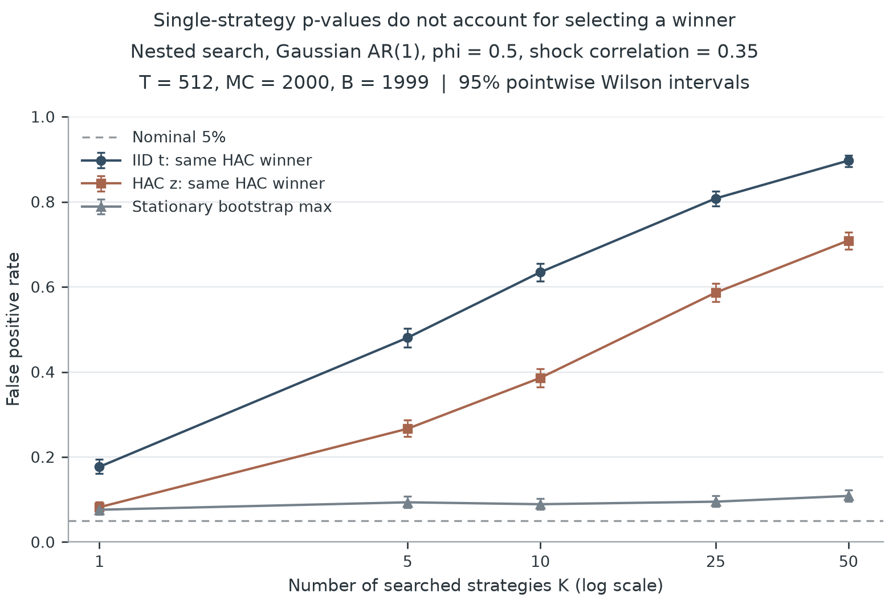

# strategy-inference

时间依赖与策略筛选之后的平均收益推断。

一个策略的平均收益为正，并不意味着它的期望收益为正。连续观测的相关性会改变均值的标准误；从多条策略中选出表现最好的一条，又会改变检验的含义。这个项目将两种影响分开做实验，并提供一个联合处理它们的小型 Python 包。

第一阶段只研究一个问题：**对已经给定的候选策略集合，是否有策略的平均基准调整收益大于零？** 输入是同期、等间隔、已扣成本的收益差分矩阵。实现包括 IID t 检验、Bartlett HAC 推断，以及共享时间索引的 stationary-bootstrap max 检验。方法与原始研究之间的关系见[方法说明](docs/methods.md)。

完整模拟已运行。当前设置中，50 条零均值候选经过筛选后，单列 HAC 的误报率为 **70.9%**，联合 Bootstrap 为 **10.85%**（95% Monte Carlo 区间 **9.56%–12.29%**），仍高于名义 5%。第一版是用于检查这种偏差的研究基线，不能称为已校准的实务检验。详见[结果解读](docs/results.md)与[三图报告](results/full/report.html)。

## 安装

Python 3.10 或更高版本，在项目目录运行：

```bash
python -m pip install .
```

重跑实验图需要额外安装 Matplotlib：

```bash
python -m pip install '.[figures]'
```

项目尚未发布到 PyPI；上述命令从本地源码安装。

## 使用

```python
from strategy_inference import audit_returns

# excess_returns: T x K 数组，行是时间，列是完整候选集。
result = audit_returns(
    excess_returns,
    n_resamples=1999,
    seed=17,
    search_complete=True,  # 由研究者确认，软件无法从收益推断。
)
print(result.selected_name, result.global_pvalue)
print(result.to_dict())
```

全族原假设为所有候选的均值均不大于零。`global_pvalue` 是全族检验结果；`adjusted_pvalue` 是单步 max 调整后的列级结果。IID 与 HAC 的列级 p 值保留作比较，不能在筛选之后直接当作有效证据。

CSV 可包含一个可选的 `date` 列，其余列是同期策略收益差分：

```bash
strategy-inference audit examples/demo_returns.csv --output results/demo --seed 17
```

若 CSV 还含基准收益，可用 `--benchmark benchmark` 先逐列减去该基准。缺失值、重复表头、非递增日期和恒定策略会报错；程序不悄悄删行。结果保存为 JSON 与 HTML。示例数据是模拟数据，搜索记录完整性默认保留为未知。

## 三个实验

```bash
strategy-inference reproduce --profile quick --output results/quick
strategy-inference reproduce --profile full --output results/full
```

`quick` 用于检查流程，`full` 用于报告结果。完整协议在 [experiments/protocol.json](experiments/protocol.json)，种子与参数在看到结果前固定。每次运行保存原始拒绝次数、点态 Monte Carlo 区间、环境版本与文件哈希。

1. **时间依赖**：单个零均值 AR(1) 序列，比较不同自相关强度下的误报率。
2. **策略筛选**：同一批相关候选中选择最大 HAC 统计量，比较未经筛选调整与全族检验。
3. **过程与检出能力**：比较高斯 AR、由标准化 t₅ 成分构造创新的 AR、GARCH 三种过程，在零均值和植入均值信号下的表现。

完整运行还保存块长敏感性数据。三张主图分别输出 PNG、SVG、PDF，CSV 是图中数值的来源。



## 边界

检验依赖平稳性、弱时间依赖、适当矩条件及渐近近似。默认带宽与块长是事前启发式；有限样本误报率应由实验检查。去均值 Bootstrap 和固定 HAC 尺度的构造不是 Hansen SPA，也不提供有限样本精确保证。

调整只覆盖输入的候选集。隐藏试验、自适应生成策略、数据泄漏、交易成本遗漏、反复查看检验结果，以及未来市场变化，都不能由一张收益矩阵自动解决。拒绝全族原假设也不等于已经识别出可交易策略。

## 开发与阅读

```bash
python -m pip install -e '.[figures,dev]'
python -m pytest
ruff check .
```

- [方法说明](docs/methods.md)：统计目标、公式、假设、实现与失败边界。
- [结果解读](docs/results.md)：本轮模拟中的具体发现及尚未解决的校准问题。
- [项目讨论](docs/interview-notes.md)：可以据实介绍的内容，以及需要进一步掌握的问题。
- [文献](docs/references.bib)：方法来源。第一版是实现与模拟研究，不声明原创定理。

BSD-3-Clause 许可证。
