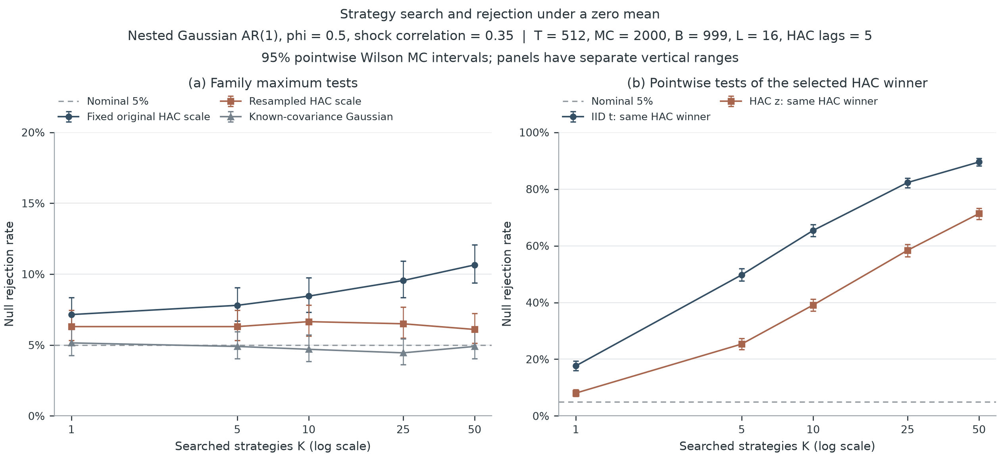

# strategy-inference

时间依赖与策略筛选之后的平均收益推断。版本 0.2.0。

[English](README.en.md) · [方法说明](docs/methods.md) · [结果解读](docs/results.md) · [实验报告](https://studyer-tang.github.io/strategy-inference/)

一个策略的样本平均收益为正，并不意味着它的期望收益为正。连续观测的相关性会改变均值的标准误；从多条策略中选出表现最好的一条，又会改变检验的含义。这个项目将两种影响分开做实验，比较不同推断方法，并保留它们失效的情形。

研究对象是一个**事先给定、有限的候选策略集合**：是否有策略的期望基准调整收益大于零？输入是同期、等间隔、已扣成本的 `T × K` 收益差分矩阵。实现包括 IID t 检验、Bartlett HAC 推断，以及共享时间索引的 stationary-bootstrap max 检验。

独立评价中，50 条零均值候选经过筛选后，未经调整的 HAC 误报率为 **71.35%**；固定尺度的联合检验为 **10.65%**，每次重抽样重新估计 HAC 尺度后降至 **6.10%**（点态 95% Monte Carlo 区间 **5.13%–7.24%**）。重新学生化改善了近似，但没有通过预设的有限场景证据门槛，不能据此宣称普遍达到名义 5% 水平。方法、原始数据和失败边界均公开。

## 安装

Python 3.10 或更高版本。从源码目录安装：

```bash
python -m pip install .
# 重跑实验图需安装 Matplotlib：
python -m pip install '.[figures]'
```

也可以从 [GitHub Release](https://github.com/Studyer-Tang/strategy-inference/releases) 下载 wheel：

```bash
python -m pip install ./strategy_inference-0.2.0-py3-none-any.whl
```

尚未发布到 PyPI。示例数据、说明文档和保存的实验结果在源码仓库中；安装后的命令行可直接运行两个实验协议。

## 审计候选策略

```python
from strategy_inference import audit_returns

# excess_returns：行是时间，列是完整候选集。
result = audit_returns(
    excess_returns,
    studentization="resampled",
    n_resamples=1999,
    seed=17,
    search_complete=None,  # 完整性须由研究者确认，软件无法从收益推断。
)
print(result.selected_name, result.global_pvalue)
print(result.to_dict())
```

全族原假设为所有候选的均值均不大于零。`global_pvalue` 是全族检验结果；`adjusted_pvalue` 是单步 max 调整后的列级结果。所选候选具有最大的原样本 HAC 均值统计量。IID 与 HAC 的列级 p 值保留作比较，单独使用它们不能处理筛选效应。

CSV 可含一个可选的 `date` 列，其余列是同期策略收益差分：

```bash
strategy-inference audit examples/demo_returns.csv \
  --studentization resampled --output results/demo --seed 17
```

若其余列含原始策略收益及基准收益，可用 `--benchmark benchmark` 先减去基准。缺失值、重复表头、非递增日期和恒定策略会报错；程序不悄悄删行。结果保存为 JSON 与 HTML。示例数据是模拟数据。

`studentization="fixed"` 仍是默认值，保留第一版的固定尺度构造；`"resampled"` 在每次重抽样中围绕该样本自身的均值重新估计 HAC，滞后阶数与原统计量一致。两者都使用列间共享的圆形时间索引和几何分布块长。完整定义见[方法说明](docs/methods.md)。

## 一键复现实验

```bash
strategy-inference reproduce --study calibration --profile quick
strategy-inference reproduce --study calibration --profile full
# 单独保留第一版固定尺度基线：
strategy-inference reproduce --study baseline --profile full
```

`quick` 检查运行流程；正式报告使用 `full`。新研究的[冻结协议](experiments/calibration-protocol.json)规定了独立评价种子、主要实验、额外场景、块长敏感性和评价门槛。[原始协议](experiments/protocol.json)及其结果继续保留。每次运行保存拒绝次数、点态 Monte Carlo 区间、环境版本、源码及输出文件哈希。

1. **时间依赖**：单个零均值 AR(1) 序列，比较不同自相关强度下的误报率。
2. **策略筛选**：从嵌套的相关候选集中选择最大 HAC 统计量，比较列级检验与联合检验。
3. **过程与检出能力**：比较高斯 AR、由标准化 t₅ 成分构造创新的 AR、GARCH，在零均值与植入信号下的表现。

三张主图各提供 PNG、SVG、PDF。图中的数值可追溯到 CSV；报告另列 6 个额外场景和块长敏感性结果。高斯场景提供使用已知协方差的参考检验，用于分辨方法误差与模拟误差；实务审计接口不使用未知的总体参数。



## 推断边界

检验依赖平稳性、弱时间依赖、适当矩条件和一致的尺度估计；理论讨论固定候选数 `K`。默认带宽与块长是事前启发式，有限样本效果需要另行检验。这里的去均值 max Bootstrap 不是 Hansen SPA，也不提供有限样本精确保证。

外层模拟的 Wilson 区间描述每个误报率估计的不确定性；预设评价使用 19 个零均值场景的同时单侧 Clopper–Pearson 上界。未达到该门槛表示证据不足，并不等于这些场景的真实误报率必然超过门槛。API 中候选均值的同时置信区间属于另一类统计对象。

调整只覆盖输入的候选集。隐藏试验、自适应生成策略、数据泄漏、交易成本遗漏、反复查看检验结果及未来市场变化，不能由一张收益矩阵自动解决。拒绝全族原假设也不等于识别出未来可交易的策略。

## 开发与阅读

```bash
python -m pip install -e '.[figures,dev]'
python -m pytest
ruff check .
python scripts/sync_protocols.py --check
python scripts/build_site.py --check
```

- [方法说明](docs/methods.md)：统计目标、公式、假设、实现和数值范围。
- [结果解读](docs/results.md)：本轮模拟的发现及未解决的问题。
- [项目讨论](docs/interview-notes.md)：围绕方法与研究设计的讨论。
- [下一阶段研究方案](docs/research-plan.md)：2026 年相关论文、拟研究的问题与待验证的边界。
- [文献](docs/references.bib)：统计方法及软件来源。本项目是实现与模拟研究，不声明原创定理。

BSD-3-Clause 许可证。
