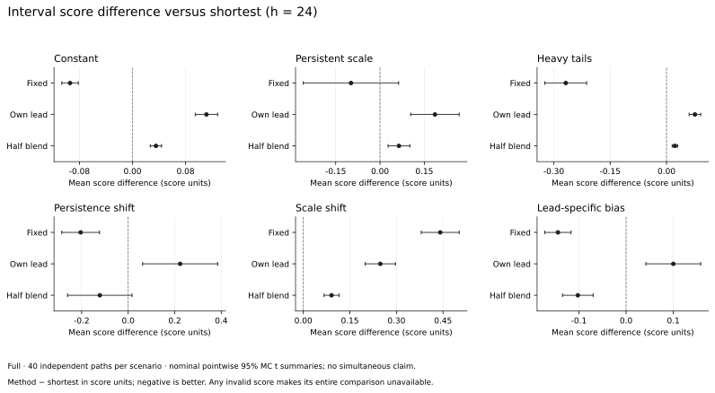
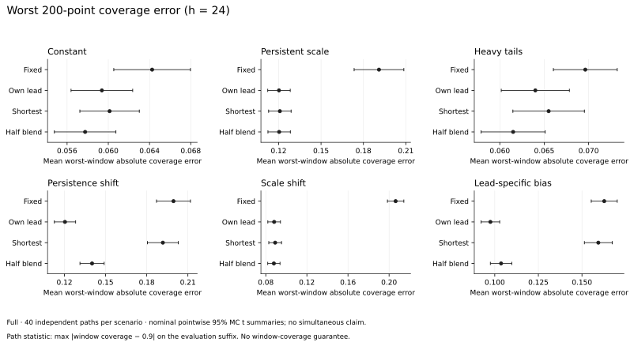
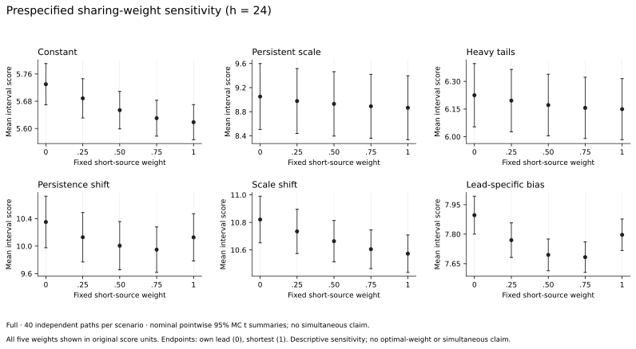

# 固定权重尺度共享：模拟评价

在本次有限模拟的 18 个长步长情形中，固定半权重混合比自身步长 EWMA 的观察平均 interval score 更低；相对最短步长共享则是折中。h=24 的预测偏差情形评分与局部覆盖误差改善，持久性切换的评分差摘要跨零，其余四个情形评分更高。固定尺度在六个 h=24 情形中有五个观察平均评分低于半权重混合，因此本轮不支持把混合设为统一最优或通用默认。

[固定协议](../experiments/blended-scale-protocol.json)与[复现程序](../scripts/reproduce_blended_scales.py)声明六种尺度方案、六个压力情形和四个物理步长。每个情形有 40 条独立路径，共 240 条；每条含 3000 个观测，初始训练前缀为 600，评价再排除前 128 个发行起点。滚动 AR(1) 拟合只使用预测起点已观测的数据，初始各步长尺度由训练前缀内共同目标时点的预测残差 RMS 计算。所有方案使用相同点预测、初始尺度、阈值更新率与成熟反馈时钟。

主候选是固定半权重混合：同一步长成熟残差的 EWMA RMS，与最短步长成熟残差 EWMA RMS 按初始尺度比率传递的尺度，各占一半。对照保留固定尺度、自身步长与最短步长共享；0.25、0.75 权重仅作预先声明的描述性敏感性评价。半权重来自工程阶段选择，本轮使用独立路径；选择历史在固定协议中保存，不将该选择描述为独立发现研究，也不按正式结果选择最优权重。

所有过程以 $y_t=\phi_t y_{t-1}+\sigma_t\varepsilon_t$ 生成，先丢弃 1024 个 burn-in 观测。除特别说明，$\phi=.65$、$\sigma=1$，创新为标准 Gaussian。切换点固定在保留序列的 45%、75%；不是根据模拟表现挑选。

| 过程 | 预设变化 |
| --- | --- |
| 常数尺度 | 无变化 |
| 持续随机尺度 | $\log\sigma_t=.985\log\sigma_{t-1}+.1z_t$，$z_t$ 为独立标准 Gaussian；log-scale 初始分布取其平稳边际 |
| 重尾创新 | 自由度 3.5 的 Student-t，乘 $\sqrt{(3.5-2)/3.5}$ 使创新方差为 1；四阶矩不存在 |
| 持久性切换 | $\phi$ 从 .65 切到 .95，再切到 .35，尺度不变 |
| 尺度切换 | $\sigma$ 从 1 切到 3，再回到 1，$\phi$ 不变 |
| 步长特有预测偏差 | 中段发行的滚动预测额外加 $2.5[(h-1)/23]^2$；最短步长不受影响。这是刻意加入的预测污染 |

滚动 AR(1) 含截距，每次最多使用 256 个已观测值，斜率投影到 $[-.995,.995]$ 后重新计算截距。尺度 EWMA 系数为 .97，阈值初值 .65，目标误覆盖 .1，反馈步长为 $.1h^{-1/2}n^{-.2}$，其中 $n$ 是该步长成熟数量。这些参数在正式数据生成前固定；它们不是已证明的最优值。

[完整路径记录](../results/research/blended-scales/full/results.json)保留全部方法、情形和步长，共 5760 条逐路径汇总，每条评价 2249 个起点。正式种子基数为 7309351，与开发路径分离；这批种子在上一阶段协议中已为独立完整评价保留。预测器由滚动窗口估计参数，不使用生成过程的真实 AR 系数或未来创新尺度作为 oracle。[源码快照](../results/research/blended-scales/full/source.zip)与[源码清单](../results/research/blended-scales/full/source-manifest.json)冻结 31 个源文件；ZIP 的 SHA-256 为 `dc854fa1943b6b1cabf024793027a6f8f4243040012b3194e854b43965a237b4`。

平均 interval score 越低越好；配对差先在同一路径内计算，再跨独立路径汇总。图表中的 t 误差条按这批有限路径的均值与样本标准差计算，是逐项、名义 95% Monte Carlo 摘要，未经认证为总体风险置信区间，也不提供同时显著性、真实数据上的置信保证或一般效率定理。任一空集、全域或数值溢出使相应整组分数及配对分数无法汇总，不删除异常路径后计算均值。本次 5760 条记录的评分均有限，没有异常评分组。

阈值 q 不截断，算法仍允许空集或全域状态。如果全域区间以任意正概率出现，无条件原始 interval score 的期望可以为无穷；空集的评分无定义。有限样本中未出现这些状态不证明总体期望有限。因此，即使某些名义 t 摘要完全位于零的一侧，也不能据此声称普遍、严格的总体评分优势。

下表展示 h=24 半权重方案减去各基线的原始分数差，负数表示半权重的观察评分更低。h=6、12、24 相对自身步长的 18 个名义 t 摘要均完全低于零；这仍不构成总体风险或跨情形和步长的同时保证。

| 过程 | 相对自身步长差及名义 95% MC 摘要 | 相对最短共享差及名义 95% MC 摘要 |
| --- | --- | --- |
| 常数尺度 | −0.0762 [−0.0859, −0.0666] | +0.0354 [+0.0269, +0.0438] |
| 持续随机尺度 | −0.1217 [−0.1695, −0.0740] | +0.0642 [+0.0275, +0.1010] |
| 重尾创新 | −0.0532 [−0.0625, −0.0440] | +0.0223 [+0.0151, +0.0296] |
| 持久性切换 | −0.3451 [−0.4059, −0.2842] | −0.1217 [−0.2603, +0.0168] |
| 尺度切换 | −0.1572 [−0.1845, −0.1300] | +0.0909 [+0.0669, +0.1149] |
| 步长特有预测偏差 | −0.2021 [−0.2344, −0.1698] | −0.1022 [−0.1346, −0.0698] |



局部指标先在每条路径内取所有 200 个连续评价起点窗口的覆盖率与 90% 的最大绝对偏差，再跨独立路径汇总。整体覆盖接近目标并不保证这个指标改善。现有覆盖递推控制完整成熟反馈前缀的历史平均误覆盖，不能直接作为排除 warmup 后的后缀或任意局部窗口保证。

h=24 的预测偏差情形，该局部误差均值由最短共享的 0.159375 降到半权重的 0.103625，描述性降低约 35%；持久性切换由 0.191750 降到 0.140125，约 27%。但这两个半权重均值仍高于自身步长方案的 0.097500、0.120375。半权重在这些情形下兼顾了自身方案的评分与最短共享的局部适应代价，并未同时胜过所有对照。



权重敏感性图按固定顺序展示 0、0.25、0.5、0.75、1，端点分别为自身步长与最短步长共享。各点使用原始分数单位和逐项、名义 Monte Carlo t 摘要，图中不标记“最优”权重。



在冻结源码和协议下生成正式记录；绘图只读取保存的路径账本，不重新拟合模型：

```bash
python -m pip install -e '.[figures]'
python scripts/reproduce_blended_scales.py --profile full --output /tmp/blended-scales-full
python scripts/plot_blended_study.py --input /tmp/blended-scales-full/results.json --output /tmp/blended-scales-full/figures
```

绘图目录含 SVG、PNG、PDF 与 `figure-data.json`，保存输入文件、两个绘图源码、完整声明研究源码及图文件的 SHA-256，以及独立计算的图表统计量。固定混合是可选配置；本轮结果不能推断未来目标尺度、恢复真实波动率、保证条件或联合覆盖，也不能推广为所有预测器与过程下的默认选择。
