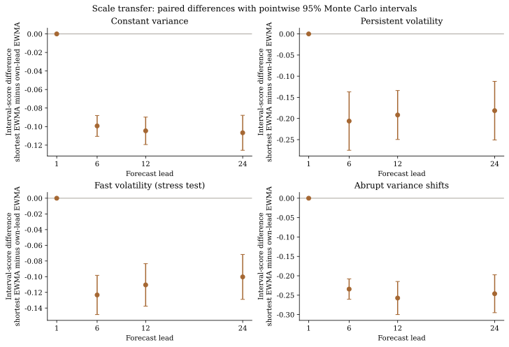
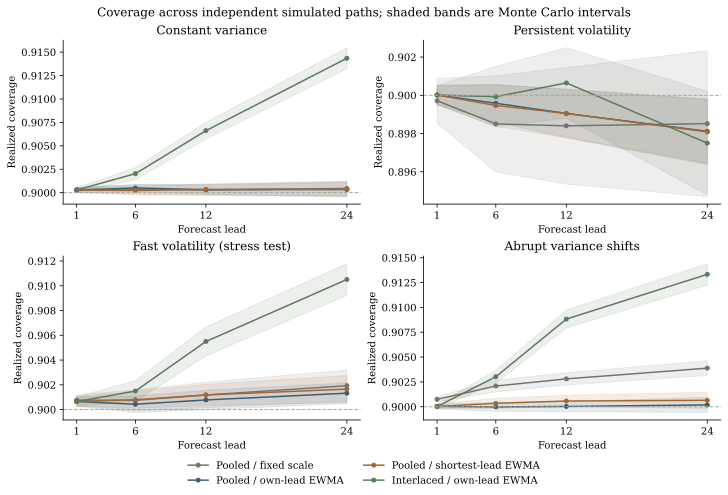
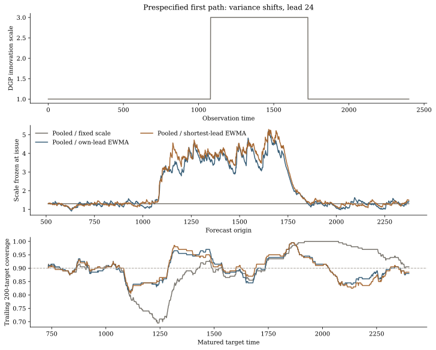

# 成熟反馈与尺度共享：v0.7 模拟结果

本轮考察一个具体问题：多步在线区间使用同一步长的成熟残差估计尺度，还是共享最短步长的成熟残差？在固定的四种 AR(1) 过程里，共享方案相对自身步长 EWMA 降低了长步长平均 interval score，整体覆盖相近。但它不是所有方法中统一的最优方案，也没有改善局部覆盖的一般保证。

[协议](../experiments/multistep-protocol.json)、[完整记录](../results/research/multistep/full/results.json)和[复现程序](../scripts/reproduce_multistep.py)保存设置、逐路径结果、输入指纹以及源码、协议、runner 和图文件的 SHA-256。[方法说明](multistep-methods.md)给出独立递推证明；[API](multistep-api.md)说明如何接入预测器。

## 实验设计

固定物理步长为 1、6、12、24，目标覆盖率为 90%。每个过程生成 40 条独立路径，共 160 条；每条含 2400 个观测，初始训练前缀为 512。四种方法使用同一路径与同一预测起点，评价再排除前 128 个起点。所有评价目标均成熟，不用未知标签填补末尾。

过程满足 `y[t] = 0.65*y[t-1] + sigma[t]*z[t]`，创新标准正态。四个情形是常数尺度、持续随机尺度、快速随机尺度以及尺度由 1 升至 3 再降回 1。随机尺度参数和变点位置在协议中固定。预测使用已知条件均值 `0.65**h*y[origin]`，目的是隔离区间校准，不能据此推断估计参数、复杂模型或实际金融预测下的效果。初始尺度只由训练前缀内各步长残差确定，之后仅用成熟反馈。

四个方案分别为 pooled 固定尺度、pooled 自身步长 EWMA、pooled 最短步长 EWMA 共享，以及 interlaced 自身步长 EWMA。EWMA 衰减为 0.97，学习率为 `0.1/sqrt(h) * n**(-0.2)`，初始阈值为 0.65。Pooled 的 n 统计该步长所有成熟反馈；interlaced 的 n 只统计所在相位的成熟反馈，所以两者差异还包含学习时钟的变化。

区间评分为宽度与漏覆盖距离的组合，越低越好。先在每条路径内取评价平均，再跨独立路径汇总；配对差同样先在同一路径内计算。95% Monte Carlo t 区间使用 40 个独立重复，量化当前模拟均值估计的随机误差，不把重叠预测当作独立 Bernoulli 样本，也不提供跨情形或跨步长的同时置信保证。

若任一路径出现成熟空集、全域或评分溢出，相应整组评分和配对评分均不汇总，不删除异常路径后计算有利均值。本次正式记录没有这类未定义评分组。

## 主要结果

下表为 h=24，共享方案减去自身步长 EWMA 的配对评分差。百分比是两组平均评分之差除以自身步长平均评分，属于描述量。

| 过程 | 配对评分差 | 点态 95% MC 区间 | 平均评分降低 | 自身 / 共享平均覆盖 |
| --- | ---: | --- | ---: | --- |
| 常数尺度 | −0.1067 | [−0.1255, −0.0878] | 1.89% | 90.033% / 90.037% |
| 持续随机尺度 | −0.1815 | [−0.2508, −0.1122] | 2.02% | 89.811% / 89.809% |
| 快速随机尺度 | −0.1003 | [−0.1289, −0.0716] | 1.16% | 90.132% / 90.166% |
| 尺度切换 | −0.2462 | [−0.2950, −0.1974] | 2.33% | 90.019% / 90.065% |

h=6 和 h=12 的配对差也为负；h=1 两个方案完全一致。这支持在本协议下共享成熟尺度能够提高相对于自身 EWMA 的评分效率，全部 h=6、12、24 情形的平均评分降低约 1.2%–2.6%。它没有建立一般效率定理，覆盖相近也不等于已经证明两个方案等效。

完整四方法比较还显示：在常数尺度和快速尺度的 h=24 情形，固定尺度评分低于两个 pooled 自适应尺度方案；在持续尺度情形，interlaced 自身尺度评分最低。后者同时改变学习时钟，不能解释成尺度信息的单独收益。共享方案适合作为可选配置，目前没有证据将其设置为通用默认。





## 局部适应与解释范围

第三张图使用预先确定的尺度切换过程第一条路径，不从 40 条里选择最漂亮的轨迹。图中比较发行尺度与 200 起点局部覆盖；顶部曲线显示尺度切换，覆盖虚线表示 90% 目标。轨迹图包含启动段；汇总指标排除前 128 个发行起点。整体覆盖接近 90% 时，变化附近的局部覆盖仍会偏离目标。

例如 h=24，尺度切换情形的最差局部覆盖绝对误差，跨路径平均为自身 EWMA 的 0.0881、共享方案的 0.0904；快速尺度情形分别为 0.0660、0.0701。因此本轮评分收益没有同时带来这项局部指标的改善。方法证明只控制每个步长已成熟前缀的历史平均误覆盖，不能用来保证任意局部窗口。

每时发行且队列填满后，各步长都会在同一日历时点收到当前标签。共享方案没有提前取得长步长标签；最短与长步长残差对应不同预测起点，含有不同累计误差与相关信息。这才是共享尺度的实验问题。长步长阈值自身的 h 步反馈延迟仍然存在。



快速尺度原本是协议里用于挑战远期尺度共享的情形；冻结文本将它称为“prespecified counterexample”。正式结果没有显示所设定的评分反例，因此这里将其解释为预设压力情形，不将该措辞当作已经观测到的结论，也没有在看到结果后换过程、选种子或调整参数。

## 开发选择与复现

工程预览每个过程 4 条路径、共 16 条，使用统一学习率 0.1，在长步长产生过空集或全域。正式协议在新的、不重叠的种子上固定按步长缩小学习率，再运行上述 160 条路径。这个设计受预览启发，不能描述为完全预注册的优越性检验。降低学习率可能减少边界状态，也可能减慢适应；本轮没有搜索最优学习率。

[开发记录](../results/research/multistep/development-01/README.md)保存该预览的设置与原始诊断，不用于正式效应估计；它没有完整冻结源码快照，不能声称可逐位重跑。正式记录绑定 v0.7 源码。不要混合两个阶段的模拟结果。

在 v0.7.0 checkout、安装 figures 依赖后，一条命令生成 JSON 与三张图的 SVG、PNG、PDF：

```bash
python -m pip install -e '.[figures]'
python scripts/reproduce_multistep.py --profile full --output /tmp/multistep-local
```

输出目录须为空或不存在。跨平台浮点与绘图库可能改变末位或图文件字节；源码、参数、输入指纹和统计结果应一起核对。未来拓展需要事先固定的新过程与真实预测误差评价，尤其考察预测偏差、重尾、步长间尺度比率失效和局部适应；本轮结果不覆盖这些情况。
